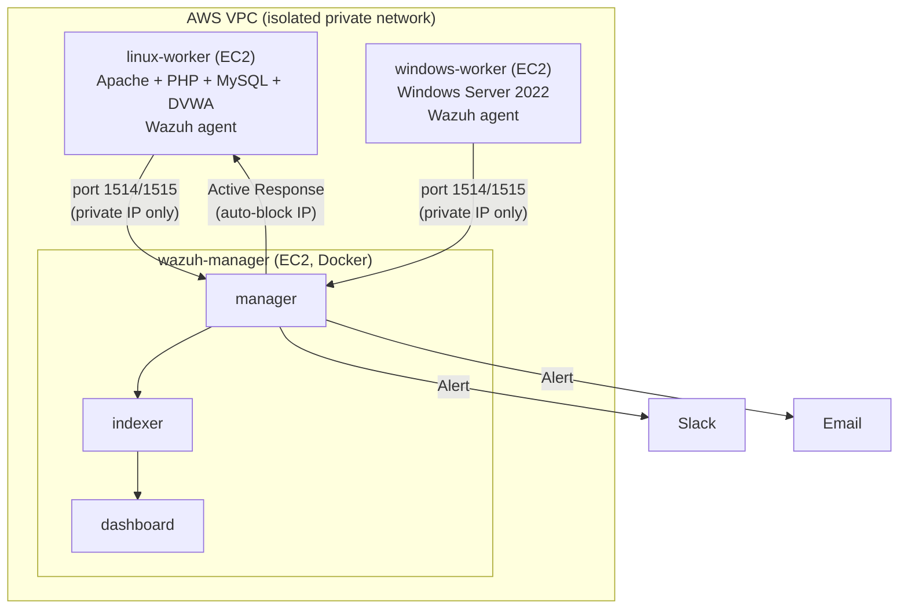

# Wazuh SIEM/SOAR Proof of Concept

A hands-on build of a working Wazuh SIEM deployment in an isolated AWS sandbox —
demonstrating log ingestion, detection engineering, alerting, and automated
response (SOAR) against a deliberately vulnerable target application, across
both Linux and Windows endpoints.

## What it is

This is **not** one machine doing everything. It's **three separate virtual
machines, all running in AWS's cloud** (not on any local laptop), each doing
one job, talking to each other over a private network:

- **`wazuh-manager`** — a security office. Runs Docker, and inside Docker,
  three containers work together: one watches for suspicious patterns (the
  actual "manager"), one stores every event ever reported (the "indexer"),
  and one is the web dashboard a human logs into to look at everything.
- **`linux-worker`** — a decoy shop with intentionally broken locks. Runs
  DVWA (Damn Vulnerable Web Application) — a real, deliberately vulnerable
  website — plus a small background program (the Wazuh **agent**) that
  watches everything happening on this machine and reports back to
  `wazuh-manager` over the network. No Docker here at all — DVWA and the
  agent are both installed the plain, ordinary way.
- **`windows-worker`** — a second decoy, this time a Windows Server 2022
  box, running its own Wazuh agent. Added to prove detection isn't
  Linux/web-only — this one watches native Windows security events (like
  new local user accounts being created) instead of web server logs.

A laptop is only ever the remote control — it connects to each machine
(SSH for the Linux boxes, browser-based RDP via AWS Systems Manager Fleet
Manager for the Windows box) to run commands, but nothing described above
actually runs on the laptop itself.

## Architecture

## Why each piece exists

| Component | Purpose |
|---|---|
| AWS VPC + subnets | An isolated private network so these machines aren't exposed to the whole internet by default |
| Security Groups | Per-machine firewalls — only specific ports, from specific sources, are allowed in; verified zero `0.0.0.0/0` exposure |
| `wazuh-manager` (EC2) | Hosts the full Wazuh "brain" stack via Docker |
| Docker (on manager only) | Packages manager/indexer/dashboard as pre-built, version-matched containers instead of installing each by hand |
| `linux-worker` (EC2) | Target machine #1 — runs DVWA (the thing we attack) and the agent that reports on it |
| `windows-worker` (EC2) | Target machine #2 — a native Windows endpoint, proving detection coverage beyond just Linux/web |
| DVWA | A real, intentionally vulnerable web app — something legitimate to practice attacking in a legal, contained way |
| Wazuh agent | A lightweight always-on program that watches logs/events on each worker and ships them to the manager |
| Detection rules (XML) | Teach the manager what "suspicious" actually looks like, each mapped to a MITRE ATT&CK technique |
| Alerting (Slack/email) | Routes high-severity detections to a human, instead of requiring someone to babysit the dashboard |
| Active Response | Automated containment — the manager auto-blocks an attacker's IP, then auto-reverses it after a timeout, no human required |
| Dashboard visualizations | Turns raw stored events into an at-a-glance operational view (agent status, severity breakdown, custom detections) |

## Detection Rules

| Rule ID | Detects | MITRE Technique | Endpoint |
|---|---|---|---|
| 100002 / 100003 | Repeated failed DVWA logins (brute-force) | T1110 — Brute Force | linux-worker |
| 100004 | SQL injection attempt on DVWA | T1190 — Exploit Public-Facing Application | linux-worker |
| 100005 | New local user account created | T1136 — Create Account | windows-worker |

## Tech stack

AWS EC2 / VPC / Security Groups / Systems Manager (Fleet Manager) · Docker +
Docker Compose · Wazuh 4.14.7 (manager, indexer, dashboard) · DVWA · Ubuntu
24.04 LTS · Apache · MySQL · PHP 8.3 · Windows Server 2022

## Full Write-Up

The complete phase-by-phase build log — including every bug hit and how it
was fixed — is in [`consolidated-report.docx`](Wazuh POC.docx).
